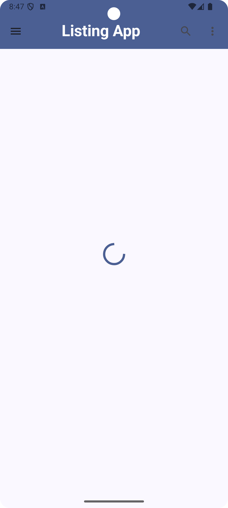
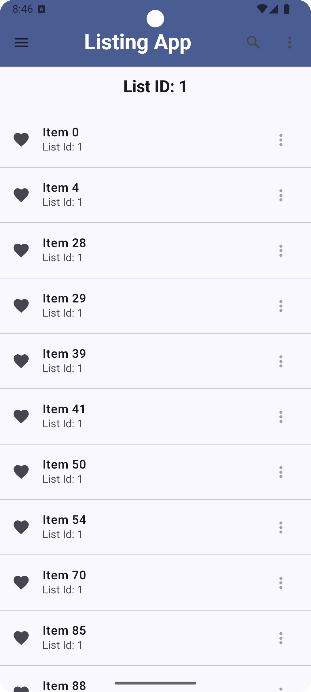
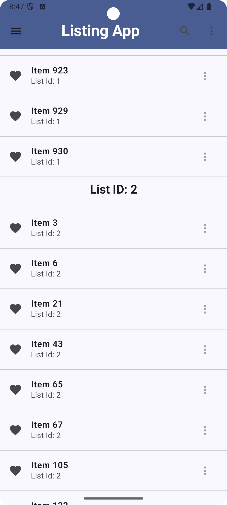
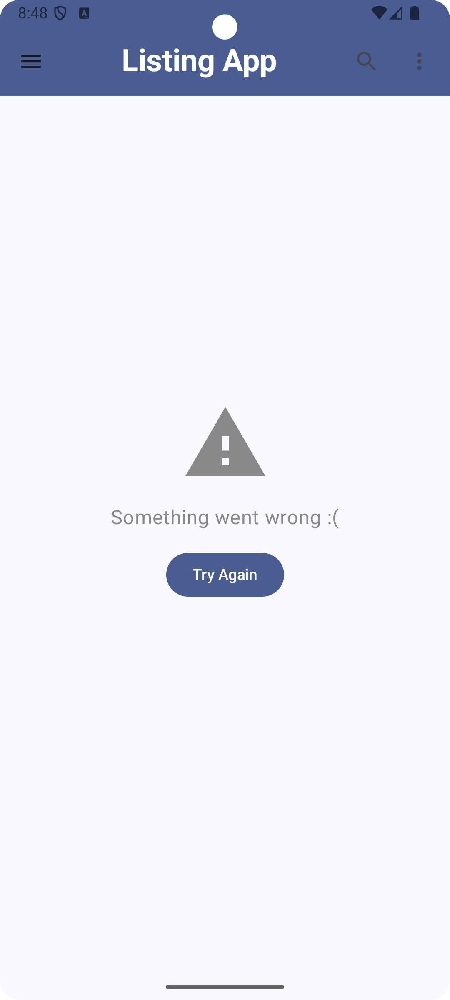

# Listing App

This is a native Android app built using **Jetpack Compose** and **Kotlin**. The app fetches and displays a list of items from a remote API, grouping and sorting the results by `listId` and `name`. It also features error handling and loading indicators for a smooth user experience.

## Features

- Fetches data from a remote JSON API using **Retrofit**.
- Displays items grouped by `listId` and sorted by `name`.
- Handles network loading and errors with user-friendly UI.
- Built with **Jetpack Compose** for a modern UI approach.

## Screenshots

| Loading | Item List |Item List | Error |
|---------|-----------|-----------|---------|
|  |  || |

## Getting Started

### Prerequisites

To run the app, ensure you have the following tools installed:

- [Android Studio](https://developer.android.com/studio)
- Android SDK
- Kotlin 1.5 or higher
- An Android device or emulator (API level 21 or higher)
  

### Code Structure

- **MainActivity**: The entry point of the app. Sets up the Compose UI.
- **ItemViewModel**: Contains the logic for fetching data and managing UI states like loading and error.
- **ItemListScreen**: Displays the fetched items in a scrollable list, grouped by listId.
- **ErrorMessage**: Handles error scenarios by showing a retry button and an error message.


### Clone the Repository

To clone this repository, open your terminal or command prompt and run:

```bash
git clone https://github.com/vikas62081/Listing-App.git
